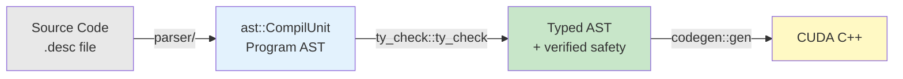
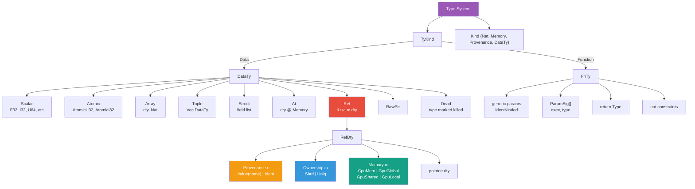
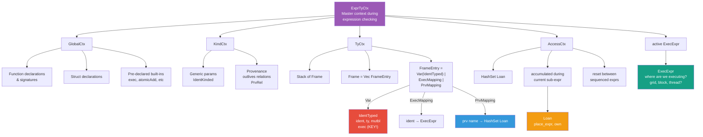
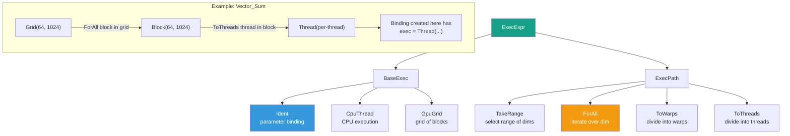
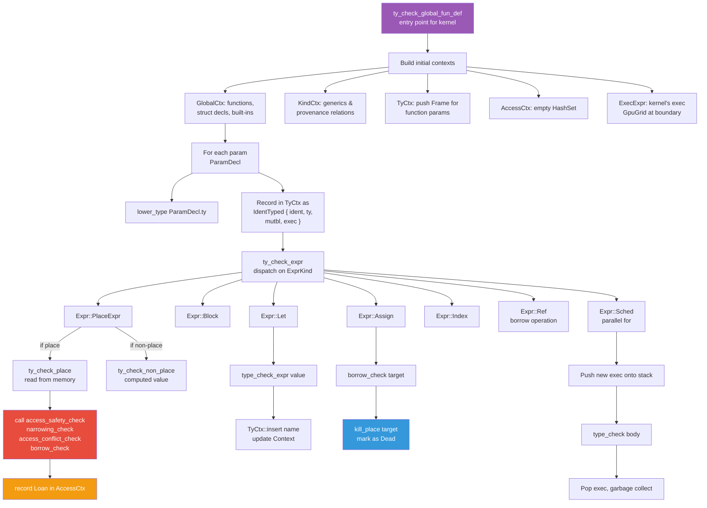
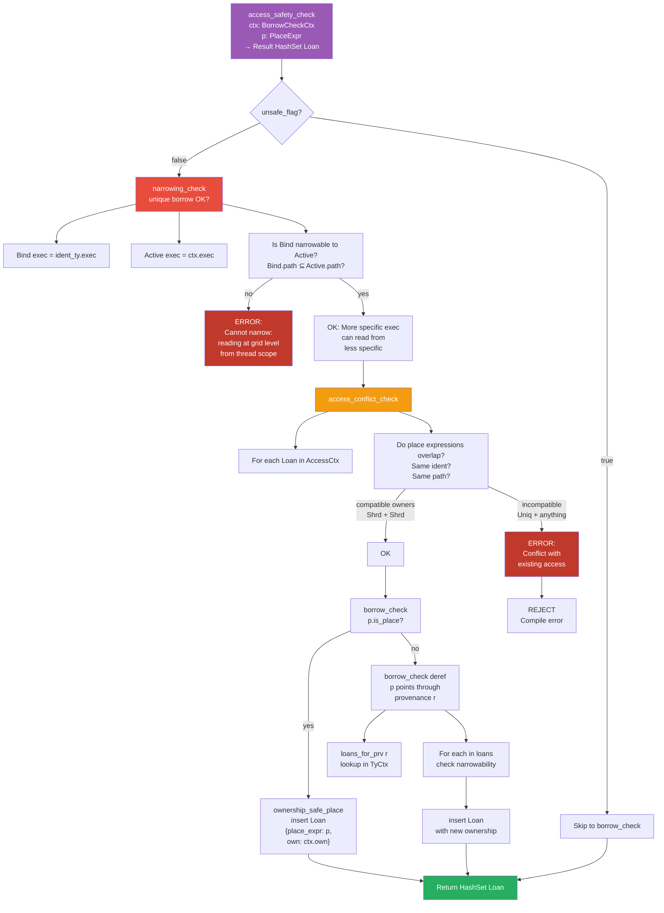
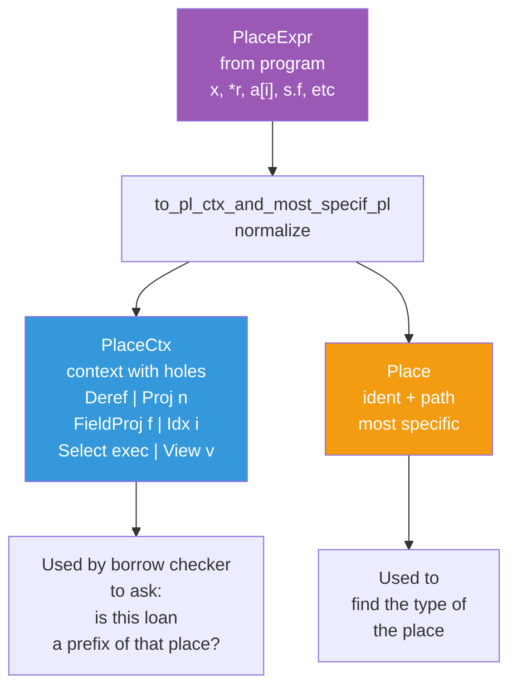
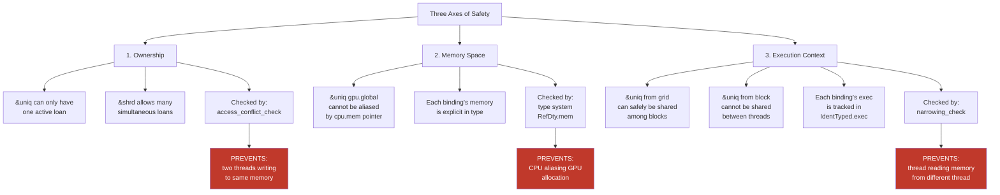
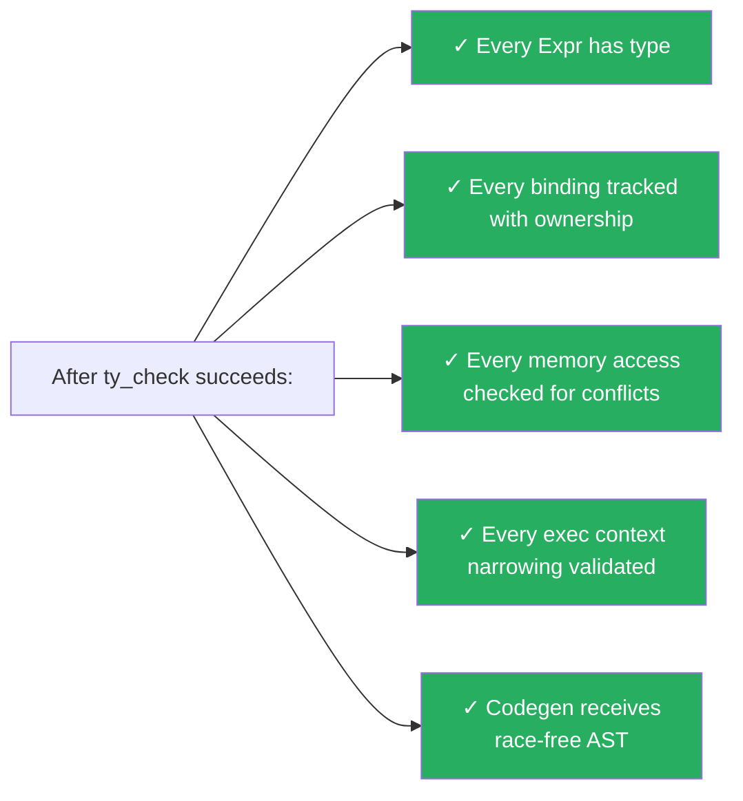

# Descend Type Checker Architecture

A visual guide to how descend's type system, contexts, and checks work together to prove data-race freedom.

## Complete Pipeline

## Type System Hierarchy

## Type Checking Contexts

## Execution Context System

## Type Checking Pass

## Borrow Checking: The Data-Race Detector

## Place Expressions: Normalized for Borrow Checking

## Data Race Prevention: The Full Picture

## Key Invariants

